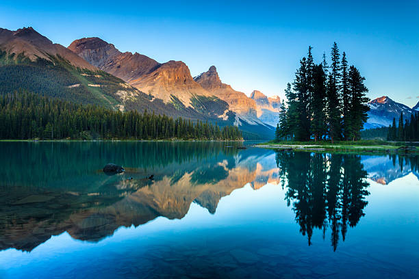
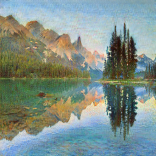
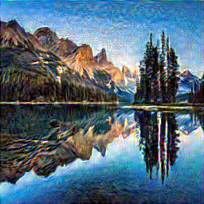

# Assignment 6 – Applying AI-Based Style Transfer to an Image

## Objective

The objective of this assignment is to compare two different methods of image style transfer:

1. CycleGAN
2. VGG-based Neural Style Transfer

## Input Image

A landscape photograph containing mountains, trees, and a lake was selected as the original image.

## Method 1 – CycleGAN

A pretrained CycleGAN model was used to transform the original landscape image into a painting-like style.

CycleGAN uses the concept of **cycle consistency**, which encourages an image translated from one domain to another to retain important information when it is translated back to the original domain.

## Method 2 – Neural Style Transfer

A VGG19-based Neural Style Transfer approach was used. The original landscape was used as the content image, while a painting was used as the style image.

The VGG19 network extracts content and style features and combines them to generate the final stylized image.

## Results

### Original Image

### CycleGAN Output

### Neural Style Transfer Output

## Written Comparison

- **Content Preservation:** Neural Style Transfer preserved the original content better because the mountains, lake, trees, and overall structure remained recognizable.
- **Style Transformation:** CycleGAN produced a stronger overall style transformation, giving the landscape a more painting-like appearance.
- **Difference:** Neural Style Transfer retained the original scene while applying the visual characteristics of the selected painting, whereas CycleGAN changed the overall visual appearance more noticeably.
- **Cycle Consistency:** CycleGAN uses cycle consistency, which helps preserve important image information by encouraging the transformed image to be recoverable back to its original domain.

## Files

- `assignment_6_code.ipynb` – Python/Colab implementation
- `Assignment_6_Style_Transfer.docx` – Assignment report
- `original.jpg` – Original image
- `cycleGAN_output.png` – CycleGAN result
- `neural_style_output.png` – Neural Style Transfer result
- `assignment6_comparison.png` – Side-by-side comparison
